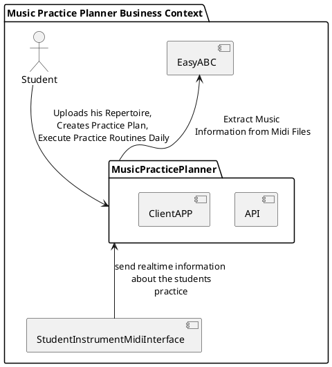
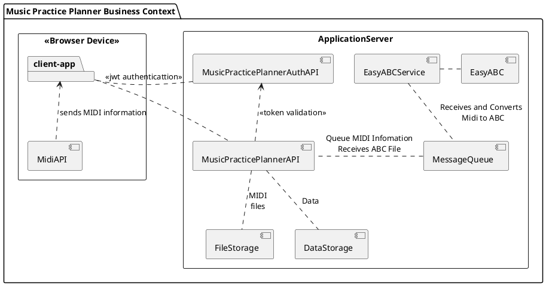
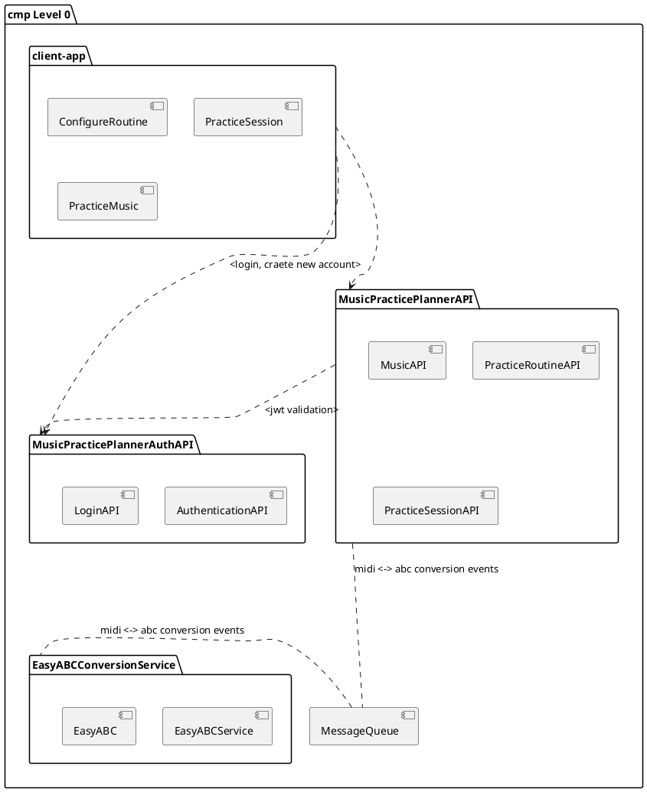
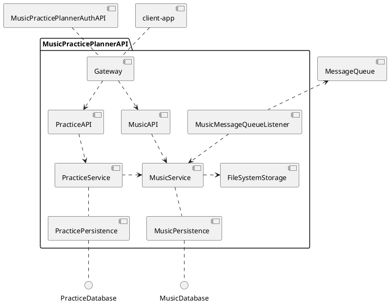

# Music Practice Planner - Architecture Design Document

## Disclaimer
This is a project to gather knowledge on the Domain Driven Design Architecture based on .Net Core - Not intended to be published by anyways
A big thanks to Michael Simons for his [biking architecture document](https://biking.michael-simons.eu/docs/index.html). His document acts as a model for my learning process.
Do not copy this project. 

This document is best viewed with a markdown viewer with plantUML support.

### Introduction and Goals

The Music Practice Planner is a project built with the intention of learning software architecture design by practicing it. 

The application itself aims to track my music practice easily, following the AAR Rule defined by [Jazzer Lee](https://www.youtube.com/watch?v=13Qa9mpCHo0). 

The mainly achievements for this project are:

* Learn about software architecture and design

* Register What Musics I want to have in my repertoire.

* Track my daily practice session 

## 1.1. Requirements Overview

The Music Practice Planner, as a software has the following features:

* Create Student Accounts
* Register the musics that students want to learn
* To allow users to create a practice session plan / routine 
* Track student progression on his created daily practice
* Display a music sheet music and allow student to practice sections of the music according to the AAR Practice.
* Desirable - student will be able to upload a midi of the music and then covert it to a format that system can show and work with.     

## 1.2. Quality Goals 

| Nr | Quality | Motivation |
|----|---------|------------|
| 1  | Backend Development Knowledge | The project is simple and intends to be developed following the best standards in C# and ASP\.NET Core |
| 2  | Frontend Development Knowledge | Despite simple, the frontend can grow in complexity by using libraries to render sheet musics and read midi files, React will be used, so the focus is to learn usage of it in a "real" application |
| 3  | Systems Design | Create and Document the software in a way that everyone in touch of this project will understand it's needs and keeps tracks of its involvement  |
| 4  | Testability | The project architecture must allow testing all the building blocks. |

## 1.3. Stakeholders

Below are the important personas for the application

| Role | Goal |
|---------|------------|
| Backend Developer | Who wants to learn about software development, Asp.Net |
| Frontend Developer | Who wants to learn about usage of frameworks such as react and usage of music libraries |
| Music Students | Who wants an application that they can use to learn how to play piano |
| Software Aspirants | Who want to see how this application was developed |
| Me (André Lelis) | Who wants to learn about all the previous aspects |

## 2. Architecture Constraints

A few constrains of the architecture. 

### 2.1 Technical Constraints

|  | Constrain | Motivation |
|----|---------|------------|
| T1  | Backend Development using \.Net Core | Since this is a part of learning process, the Backend APIs structure must follow that language. During research tests, I found some features that are exclusive in other platforms, if this is used, a service must be created to perform the Interoperability communications |
| T2  | Frontend must use React | Also part of the learning process React must be used. If mobile is built someday, React Native usage will be a constraint and also Typescript as a main language for the frontend projects |
| T3  | Automated deploy | An automated deployment process must be created |
| Hardware constrains ||
| T4  | Deploy on a Free Tier Cloud Provider | Since this project won't be hosted a "demo" with all the features could be deployed on a free tier level |

### 2.2 Organization Constraints

|  | Constrain | Motivation |
|----|---------|------------|
| OC1  | Team | Me |
| OC2  | Time schedule | Started in December 2023 - Intend to have a MVP version with most of the features on the roadmap by March 2024, from there I will plan the next MVP and Date |
| OC3  | Version Control | Public git repository for now. Can be locked in the future if the project grows to a more serious thing of if I start to have external issues |
| OC4  | Configuration | All Configuration must be grouped on a single configuration |
| OC5  | Testing | xUnit will be used for testing background features and Jest will test the frontend - Coverage will be managed using SonarQube and a 90% of code coverage is needed. |

### 2.3 Conventions

|  | Convention | Motivation |
|----|---------|------------|
| C1  | Architecture Documentation | Based on the arc42-template version 6.5 following Michael Simmon's [Biking2 Architecture Documentation](https://biking.michael-simons.eu/docs/index.html) |
| C2  | Coding Convention | For the Backend .Net usage of [Common C# code convetions](https://learn.microsoft.com/en-us/dotnet/csharp/fundamentals/coding-style/coding-conventions). On The Frontend a complete code convention document can be found on [this post](https://levelup.gitconnected.com/react-code-conventions-and-best-practices-433e23ed69aa) from Gaspar Nagy |
| C3  | Language | English for all the project |
| C4  | Music Language | English Grammar for Music Notes (ABCDEFG) - More details can be found on (MusicTheory.Net)[https://www.musictheory.net/lessons] |
| C5  | Sheet Music | Sheet music notation [ABCNotation](https://abcnotation.com/) will be used in order to store music details to be rendered, this option was motivated due to this be a human-readable notation |

## 3. System Scope and Context

The environment and context of the software is defined below.

## 3.1. Business Context

#### Student
A music student that wants to practice. He defines his repertoire, creates a new practice plan and daily execute his practice plan.

#### StudentMidiInterface
The entrypoint for the student's musical instrument. Student will be able to connect his instrument to track his progression when he is playing.

#### EasyA
A python application that converts midi music to a "human-readable" format to display sheet musics

## 3.2. Technical Context

#### Backend / Application Server

* **MusicPracticePlannerAPI**: The API of the music practice planner, used by the frontend application "client-app" to send and receive data 

* **MusicPracticePlannerAuthAPI**: The Authentication API providing Account creation and JWT Tokens for the application

* **EasyABCService**: The Service Wrapper for the EasyABC application, needed if we want to add the desired feature to covert midi file to abc notation. 

* **MessageQueue**: Since the conversion is an internal application it uses resources from the application server, therefore a messaging system is needed to maintain the efficiency of the application flow.

* **FileStorage**: File storage is used to store the midi files for the project. 

* **DataStorage**: Data storage for all the application data. 

#### Frontend

* **MidiAPI**: The HTML5 Midi API interface to allow midi connection on application

* **client-app**: The React application of music planner 

* **PracticeRoutine**: Components for the Student to manage the Practice Session

* **SheetMusic**: Display the Sheet music using ABC notation

* **MidiConnection**: Connects and listens the Midi API to track the notes

# 4. Solution Strategy 

## 4.1. Frontend
The music tracker application will have some little complex features on the frontend such as:

* Display the Sheet Music on the section that the student is currently learning

* Connect Midi Interface and listen to the instrument information

* Keep track of the music section while the user is playing

Since the frontend needs to display the sheet music information the best is to use some libraries to render that. During the research phase I found the [ABCjs](https://github.com/paulrosen/abcjs) that can render sheet music based on the ABC Notation. The ABC Notation will be used as a main base to the musics in order for the system to understand it.    

As mentioned, React will be used as a main Frontend Framework, the main purpose of this is to improve my learning skills in React framework. 

## 4.2. Backend

On the backend the application will have a domain model with the models "Music", "PracticeRoutine", "PracticeSession" as the most important ones. 

Since there will be a feature to perform upload of midi file and convert it to ABC music notation, the backend also will use a tool in python to perform this conversion. 

In order to use the tool a Messaging Queue System will be used to periodically send requests to the conversion system. That will not block the performance of the application while we are waiting for the conversion to take place. 

## 5. Building Blocks View

Here is the high level of the application

## 5.1. Whitebox MusicPracticePlannerAPI

The diagram shows a decomposition of the whole Music Practice API in a project structured level. 
APIs and MessageQueueListener are the main entrypoints of the package, responsible to gather the information on the Music
For now, since the application will run in a single server, same database system can be used for the PracticeDatabase and MusicDatabase

* **[Gateway](#511-gateway-blackbox)**: The entrypoint of the application, it will use MusicPracticePlannerAuthAPI as authority on the JWT Token validation 

* **[PracticeAPI](#512-practiceapi-blackbox)**: API for the student to register and perform music practice sessions

* **[PracticeService](#513-practiceservice-blackbox)**:  Service for the practice sessions 

* **PracticePersistence**: Persistence of the practice sessions 

* **[MusicAPI](#514-musicapi-blackbox)**: API for the student to register music and perform upload of the midi files 

* **[MusicMessageQueueListener](#515-musicmessagequeuelistener-blackbox)**: The listener will be responsible to receive event notifications of converted midi files 

* **[MusicService](#516-musicservice-blackbox)**: Music service will register the music details, save midi file on filesystem and send notification to the message queue about midi uploded

* **MusicPersistence**: Persistence of the saved 

* **FileSystemStorage**: Used to store the midi files

## 5.1.1. Gateway (blackbox)

Provides full access of internal entrypoints on the system, performs the action of token validation communicating with the token authority service

| Interface | Description |
|----|---------|
| RESTinterface   /api/v1/music/*   | maps to the Music API |
| RESTinterface   /api/v1/practiceroutines/*   | maps to the Practice API |

## 5.1.2. PracticeAPI (blackbox)

Provides access to the practice API functionality

| Interface | Description |
|----|---------|
| RESTinterface   /api/practiceroutines/*   | Containing CRUD operations of Practice Routines |
| RESTinterface   /api/practiceroutines/{id}/sessions/*   | Containing Operations for practice sessions |

## 5.1.3. PracticeService (blackbox)

Provides CQRS methods used by Practice API to accomplish its features

| Commands | Description |
|----|---------|
| CreatePracticeRoutine   | Creates the practice routine  |
| UpdatePracticeRoutine   | Updates the practice routine |
| RemovePracticeRoutine   | Remove the practice routine |
| StartPracticeSession   | Starts a practice session |
| StopPracticeSession   | Stops a practice session |
| SavePracticeInformation   | Register the practice information related to the music |

| Queries | Description |
|----|---------|
| ListPracticeRoutines   | Lists the Practice Routines  |
| FindPracticeRoutine   | Find the practice routine |
| ListPracticeSessions   | Gets all sessions related to a practice routine |
| GetCurrentPracticeSession | Gets the current session that student is executing |
| GetPracticeSession | Gets a practice session |

## 5.1.4. MusicAPI (blackbox)

Provides access to the music API functionality

| Interface | Description |
|----|---------|
| RESTinterface   /api/music/*   | Containing CRUD operations of Music Information |

## 5.1.5. MusicMessageQueueListener (blackbox)
Connects to the MessageQueue and listens for events

| Event | Description |
|----|---------|
| ABCNotationCreated | Sends the information to the MusicService to update the music's abc notation |

## 5.1.6. MusicService (blackbox)

Provides CQRS methods used by Music API to accomplish its features

| Commands | Description |
|----|---------|
| CreateMusic   | Creates the music  |
| UpdateMusic   | Updates the music |
| RemoveMusic   | Remove the music |
| UpdateMusicABCNotation   | Updates the music's abc notation |

| Queries | Description |
|----|---------|
| ListMusics   | Lists the musics  |
| FindMusic   | Find the music |

